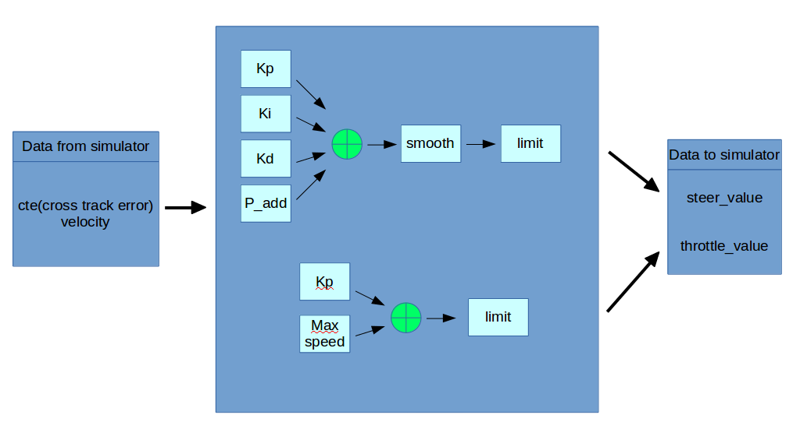

# CarND-Controls-PID
Self-Driving Car Engineer Nanodegree Program

Zhenglei 2018 April

# Description
In this project you'll revisit the lake race track from the Behavioral Cloning Project. This time, however, you'll implement a PID controller in C++ to maneuver the vehicle around the track!

The simulator will provide you the cross track error (CTE) and the velocity (mph) in order to compute the appropriate steering angle.

# Control structure

## Basic Build Instructions

1. Clone this repo.
2. Make a build directory: `mkdir build && cd build`
3. Compile: `cmake .. && make`
4. Run it: `./pid`. 

# Tune history
1) Kp = 0.03, Ki=0.0 Kd=5
   big overshoot in line, Kd too big
   
2) Kp = 0.03, Ki=0.0 Kd=3
   small overshoot, Kd still too big
   
3) Kp = 0.03, Ki=0.0, Kd=1
   smooth on the straight line, but can't go through the corner 60mph
   
4) Kp = 0.04, Ki=0.0, Kd=0.8, limit= 0.4, speed=65
    smooth on the straight line, but can't go through the corner 60mph
    
5) Kp = 0.05, Ki=0.0, Kd=0.8, limit= 0.45, speed =60
   can go through the tough corner, but too close to the edge
   output near 0.45
   
6) Kp = 0.06, Ki=0.0, Kd=0.6, limit= 0.5, speed =60
   perfect at 60mph, a little unsmooth , I think the time cycle is too big
   
6) Kp = 0.04, Ki=0.0001, Kd=0.6, limit= 0.4, speed =60
 
7) Kp = 0.05, Ki=0.000, Kd=0.9,P_add=0.12 limit= 0.5, speed = 60

8) smooth output, steer_value change 0.12 in every cycle

9) Kp = 0.04, Ki=0.0015, Kd=1.0,P_add=0.12 limit= 0.5, speed = 60
smaller Kp, bigger Ki